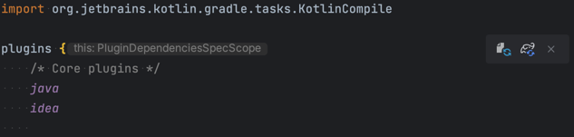

# kotlin-spring-ddd-template

## Project Structure

(TBD)

## Tech Stack

### Kotlin

(TBD)

### Spring

(TBD)

### Gradle

#### Setup Gradle

IntelliJ를 사용할 경우, Gradle의 변경이 감지되면 아이콘으로 두 가지 액션이 가능
- Load Script Configurations
  - **Kotlin Script Analysis**: build.gradle.kts 파일에 작성된 Kotlin 스크립트 코드가 다시 분석. 새로 추가한 플러그인이나 설정을 인식하기 위해서는 이 과정이 필요.
  - **IntelliSense Updates**: 스크립트 설정을 로드한 후에는 IntelliJ IDEA의 자동완성, 문법 하이라이팅, 에러 체킹 등의 IntelliSense 기능이 업데이트. 새로운 설정이나 의존성에 맞게 IDE의 동작이 업데이트.
  - **Sync Dependencies**: 새로운 의존성을 추가한 경우, 이 버튼을 클릭하면 의존성이 다운로드되고 프로젝트에 적용.
- Load Gradle Changes
  - **Dependency Resolution**: 변경된 build.gradle.kts 파일에 명시된 새로운 의존성 다운로드. 이미 캐시에 있는 의존성은 새로 다운로드되지 않음.
  - **Project Configuration**: 변경된 Gradle 설정에 따라 프로젝트의 구조와 설정 업데이트. 새로운 모듈이 추가되거나 기존 모듈의 설정이 변경될 수 있음.
  - **Task Refresh**: Gradle 태스크 업데이트. 새로운 태스크를 추가했다면, Gradle 태스크 뷰에 그 태스크가 표시됨.
  - **Build**: 필요한 경우, 프로젝트가 다시 빌드됨. 이는 설정에 따라 다르며, 모든 경우에 적용되는 것은 아님.



## Prerequisite

### Install JDK 17

JDK 17 설치: https://www.azul.com/downloads/?package=jdk   
#### JAVA_HOME 설정
```
/usr/libexec/java_home 명령어 결과가 /Library/Java/JavaVirtualMachines/zulu-17.jdk/Contents/Home 인지 확인
~/.zshrc에 export JAVA_HOME=`/usr/libexec/java_home` 라인 추가
```

## How to Run
Project는 Springboot로 구성되어 있으므로 다음 중 한가지 방법으로 실행

```
Gradle > presentation > Tasks > application > bootRun 실행
```

## Installation

> Jetbrain의 IntelliJ 환경에서 진행할 것을 권장

```bash

```

## Reference
https://kotlinlang.org/docs/get-started-with-jvm-gradle-project.html
